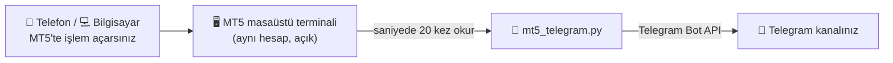

# 📡 MT5 → Telegram Sinyal Aktarıcı

[](https://www.python.org/downloads/)
[](https://www.metatrader5.com/)
[](https://core.telegram.org/bots/api)
[](#-gereksinimler)
[](LICENSE)

MetaTrader 5'te açtığınız her işlemi **aynı anda** Telegram kanalınıza yazar. Siz işlemi açarsınız, kanalınız saniyesinde görür. Stopu taşırsınız, kanalınız görür. TP gelir, kanalınız görür. Siz hiçbir şey yazmazsınız.

> 🔒 Program MT5'ten **yalnızca okur**. Hiçbir emir açmaz, kapatmaz, değiştirmez. İsterseniz MT5'e **yatırımcı (salt okunur) şifresiyle** girip kullanabilirsiniz; bu durumda program teknik olarak da işlem yapamaz.

---

## 📑 İçindekiler

- [Ne yapar?](#-ne-yapar)
- [Nasıl çalışır?](#-nasıl-çalışır)
- [Gereksinimler](#-gereksinimler)
- [Kurulum: adım adım](#-kurulum-adım-adım)
- [Kullanım](#%EF%B8%8F-kullanım)
- [Kanalda nasıl görünür?](#-kanalda-nasıl-görünür)
- [Ayarlar](#%EF%B8%8F-ayarlar)
- [Bilgisayar açılınca otomatik başlatma](#-bilgisayar-açılınca-otomatik-başlatma)
- [Sık sorulan sorular](#-sık-sorulan-sorular)
- [Sorun giderme](#-sorun-giderme)
- [Proje yapısı](#-proje-yapısı)

---

## ✨ Ne yapar?

| Olay | Kanala giden mesaj |
| :--- | :--- |
| Yeni işlem açıldı | 🟢 **BUY** / 🔴 **SELL**, giriş, SL, TP |
| Aynı anda birden fazla işlem açıldı | Hepsi **tek mesajda** (girişler ve TP'ler yan yana) |
| Az sonra aynı yönde bir işlem daha eklendi | ➕ **Ek giriş** (ilk mesaja yanıt olarak) |
| SL veya TP değişti | ✏️ **Güncellendi**: eski → yeni |
| Kısmi kâr alındı | ✂️ **Kısmi kâr alındı**, fiyat ve pip |
| TP geldi | ✅ **TP**, fiyat ve pip |
| Stop oldu | 🛑 **SL** / 🔒 **girişte kapandı** / 🔒 **stop kârda kapandı** |
| Elle kapatıldı | 🔒 **Kapatıldı**, fiyat ve pip |
| Bekleyen emir (limit / stop) | ⏳ Emir verildi, ⚡ gerçekleşti, ❌ iptal edildi |

Her güncelleme ve kapanış, işlemin **ilk mesajına yanıt** olarak gider. Kanalda her işlem kendi zincirinde okunur; hangi mesajın hangi işleme ait olduğu karışmaz.

---

## 🔧 Nasıl çalışır?



- Program, bilgisayardaki MT5 terminalini **saniyede 20 kez** kontrol eder. Bir kontrol 1 milisaniyeden kısa sürer; bilgisayarı yormaz.
- Telefondan açtığınız işlemler de aynı hesapta olduğu için masaüstü terminale anında düşer ve program onları da yakalar.
- Mesajlar sırayla gönderilir. İnternet kısa süre giderse mesajlar kaybolmaz; bağlantı gelince **aynı sırayla** gönderilir.

---

## 📋 Gereksinimler

| Gerekli | Açıklama |
| :--- | :--- |
| 🖥️ **Windows** bilgisayar veya VPS | MetaTrader 5'in Python bağlantısı yalnızca Windows'ta çalışır |
| 📈 **MetaTrader 5 masaüstü** | Hesabınıza giriş yapılmış ve **açık** olmalı |
| 🐍 **Python 3.10 veya üzeri** | [python.org/downloads](https://www.python.org/downloads/) |
| 🤖 **Telegram botu** | Kurulumda 2 dakikada oluşturacağız |

> 💡 İşlemleri telefondan açıyorsanız da olur. Masaüstü terminal ve bu program, evdeki bir bilgisayarda ya da bir Windows VPS'te açık kalsın yeterli.

---

## 🚀 Kurulum: adım adım

### Adım 1: Python'u kurun

1. [python.org/downloads](https://www.python.org/downloads/) adresinden Python'u indirin.
2. Kurulumun **ilk ekranında** alttaki **☑ Add Python to PATH** kutusunu mutlaka işaretleyin.
3. **Install Now** deyin.

> ✅ Kontrol: Başlat menüsüne `cmd` yazıp açın, `python --version` yazın. `Python 3.x.x` görmelisiniz.

### Adım 2: Programı indirin

- Bu sayfanın üstündeki yeşil **Code** düğmesi → **Download ZIP**.
- ZIP'i bir klasöre çıkarın. Örneğin: `C:\mt5-telegram-sinyal`

### Adım 3: Telegram botunu oluşturun

1. Telegram'da **[@BotFather](https://t.me/BotFather)**'ı açın ve **Başlat**'a basın.
2. `/newbot` yazın.
3. Bota bir **ad** verin (örnek: `Sinyal Botum`).
4. Bir **kullanıcı adı** verin; sonu `bot` ile bitmeli (örnek: `sinyal_aktarici_bot`).
5. BotFather size şuna benzer bir **token** verir. Kopyalayın, kimseyle paylaşmayın:

```
7123456789:AAH4k2x-ornek-token-QwErTy12345
```

### Adım 4: Botu kanalınıza yönetici yapın

1. Telegram'da kanalınızı açın → kanal adına dokunun → **Yöneticiler** → **Yönetici ekle**.
2. Az önce oluşturduğunuz botu kullanıcı adıyla arayıp seçin.
3. **Mesaj gönderme** izninin açık olduğundan emin olun → **Kaydet**.

### Adım 5: Kanal ID'sini bulun

<details>
<summary><b>🔓 Kanalınız herkese açıksa (kullanıcı adı varsa)</b></summary>

Kanal ID'si olarak kullanıcı adını yazabilirsiniz: `@kanaladi`

</details>

<details>
<summary><b>🔒 Kanalınız özelse: Yöntem A (en kolayı)</b></summary>

1. Kanalınıza herhangi bir mesaj atın (örneğin `deneme`).
2. O mesajı **[@RawDataBot](https://t.me/RawDataBot)**'a iletin (forward).
3. Gelen cevapta kanalınızın adının yanındaki `"id"` değerini bulun (`"forward_origin"` → `"chat"` ya da `"forward_from_chat"` altında). **`-100` ile başlayan** sayı kanal ID'nizdir, örnek: `-1001234567890`

</details>

<details>
<summary><b>🔒 Kanalınız özelse: Yöntem B (tarayıcıdan)</b></summary>

1. Kanalınıza bir mesaj atın.
2. Tarayıcıda şu adresi açın (`TOKEN` yerine kendi token'ınızı yazın):
   ```
   https://api.telegram.org/botTOKEN/getUpdates
   ```
3. Sayfada `"channel_post"` → `"chat"` → `"id"` değerini bulun. `-100` ile başlayan sayı kanal ID'nizdir.

</details>

### Adım 6: Ayar dosyasını doldurun

1. Klasördeki **`config.example.json`** dosyasının bir kopyasını oluşturun ve adını **`config.json`** yapın.
2. `config.json`'a sağ tık → **Birlikte aç** → **Not Defteri**.
3. İlk iki satırı doldurup kaydedin:

```json
{
  "telegram_bot_token": "7123456789:AAH4k2x-ornek-token-QwErTy12345",
  "telegram_chat_id": "-1001234567890",
  ...
}
```

> ⚠️ Tırnak işaretlerini (`"`) ve satır sonlarındaki virgülleri silmeyin. Diğer satırlara şimdilik dokunmanız gerekmez.

### Adım 7: Kurun ve test edin

1. **`kur.bat`** dosyasına çift tıklayın. Sonunda `Kurulum tamam.` yazmalı.
2. **`test.bat`** dosyasına çift tıklayın. Kanalınıza şu mesaj gelmeli:

```
✅ Bağlantı testi başarılı. İşlemler bu kanala aktarılacak.
```

> ❌ Mesaj gelmezse pencerede nedeni yazar (token hatalı, kanal bulunamadı, bot yönetici değil…). Bkz. [Sorun giderme](#-sorun-giderme).

🎉 **Kurulum bitti.**

---

## ▶️ Kullanım

1. **MetaTrader 5 masaüstü terminalini** açın ve hesabınıza giriş yapın.
2. **`baslat.bat`** dosyasına çift tıklayın. Şunu görmelisiniz:

```
[MT5] baglandi | hesap 12345678 | Broker-Server
[HAZIR] Islemler izleniyor. Durdurmak icin Ctrl+C.
[BASLANGIC] 2 acik pozisyon, 0 bekleyen emir izleniyor (mevcut olanlar kanala tekrar gonderilmez).
```

3. Pencereyi **açık bırakın** (küçültebilirsiniz). Bundan sonra açtığınız her işlem kanala gider.
4. Durdurmak için pencereye tıklayıp **Ctrl + C**'ye basın ya da pencereyi kapatın.

### Bilmeniz gerekenler

- ▶️ Program açıldığında **zaten açık olan işlemler tekrar gönderilmez**. Kanala yalnızca bundan sonraki değişiklikler gider.
- 🔁 Program kapalıyken kapanan işlemler, program tekrar açıldığında kanala bildirilir.
- 🌐 İnternet giderse mesajlar bekletilir; bağlantı gelince **sırasıyla** gönderilir.
- 🔌 MT5 bağlantısı koparsa program kendiliğinden yeniden bağlanır.
- 🛟 Program beklenmedik şekilde kapanırsa `baslat.bat` onu 10 saniye sonra yeniden başlatır.

### 🧪 Kanala göndermeden denemek

**`kuru_deneme.bat`** dosyasını çalıştırın. Program MT5'i okur ama mesajları Telegram yerine **pencereye** yazar. Ayarları denemek için idealdir.

---

## 💬 Kanalda nasıl görünür?

**Yeni işlem (3 pozisyon birlikte açıldı, iki farklı TP ile):**
```
🔴 SELL XAUUSD
Giriş: 4283.00 / 4282.91
SL: 4286.00
TP: 4276.00 / 4253.00
```

**Stop taşındı** *(ilk mesaja yanıt olarak)*:
```
✏️ XAUUSD SELL güncellendi
SL: 4286.00 → 4280.00
```

**Kısmi kâr:**
```
✂️ XAUUSD SELL kısmi kâr alındı
Fiyat: 4270.10 (+128 pip)
```

**TP1 geldi, sonra TP2 geldi:**
```
✅ XAUUSD SELL TP
Fiyat: 4276.00 (+70 pip)
```
```
✅ XAUUSD SELL TP
Fiyat: 4253.00 (+299 pip)
```

**Stop:**
```
🛑 XAUUSD BUY SL
Fiyat: 4297.00 (-30 pip)
```
```
🔒 XAUUSD BUY girişte kapandı
Fiyat: 4300.00 (+0 pip)
```

**Bekleyen emir:**
```
⏳ BUY LIMIT XAUUSD
Fiyat: 4290.00
SL: 4287.00
TP: 4297.00
```
```
⚡ Emir gerçekleşti
🟢 BUY XAUUSD
Giriş: 4290.00
...
```

> ℹ️ Altın (XAU/GOLD) için **1 pip = 0.10** fiyat hareketidir. Diğer semboller için standart pip kullanılır.

---

## ⚙️ Ayarlar

Tüm ayarlar `config.json` dosyasındadır. Değiştirdikten sonra programı yeniden başlatın.

| Ayar | Varsayılan | Ne işe yarar? | Örnek |
| :--- | :---: | :--- | :--- |
| `telegram_bot_token` | — | BotFather'dan aldığınız token | `"7123...:AAH4..."` |
| `telegram_chat_id` | — | Kanal ID'si veya `@kanaladi` | `"-1001234567890"` |
| `semboller` | `[]` | Yalnızca bu sembolleri aktar. Boş = hepsi | `["XAU", "GOLD"]` |
| `sembol_adlari` | `{}` | Kanalda görünecek ad | `{"XAUUSD": "GOLD"}` |
| `lot_goster` | `false` | Lot miktarını mesajlarda göster | `true` |
| `pip_goster` | `true` | Kapanışlarda pip sonucunu göster | `false` |
| `bekleyen_emirler` | `true` | Limit/stop emirlerini de bildir | `false` |
| `kapanislari_bildir` | `true` | TP / SL / kapanış mesajları | `false` |
| `sessiz_bildirim` | `false` | Mesajlar bildirim sesi olmadan gitsin | `true` |
| `yoklama_ms` | `50` | MT5 kaç milisaniyede bir kontrol edilsin | `50` |
| `birlestirme_ms` | `300` | Bu süre içinde açılan pozisyonlar tek mesaj olur | `500` |
| `ek_giris_saniye` | `30` | Bu süre içinde aynı yönde eklenen işlem "Ek giriş" yazılır | `60` |
| `mt5_yolu` | `""` | Birden fazla MT5 kuruluysa `terminal64.exe` tam yolu | `"C:\\Program Files\\MetaTrader 5\\terminal64.exe"` |
| `mt5_login` | `0` | Terminal otomatik giriş yapmıyorsa hesap numarası | `12345678` |
| `mt5_sifre` | `""` | Hesap şifresi (**yatırımcı şifresi yeterli**) | `"..."` |
| `mt5_sunucu` | `""` | Broker sunucu adı | `"Broker-Server"` |

<details>
<summary><b>📄 Örnek: yalnızca altın, "GOLD" adıyla, lot görünür</b></summary>

```json
{
  "telegram_bot_token": "7123456789:AAH4k2x-ornek-token-QwErTy12345",
  "telegram_chat_id": "-1001234567890",
  "semboller": ["XAU", "GOLD"],
  "sembol_adlari": {"XAUUSD": "GOLD", "GOLD#": "GOLD"},
  "lot_goster": true
}
```

Yazmadığınız ayarlar varsayılan değerleriyle çalışır.

</details>

> ⚠️ Windows yollarında ters eğik çizgiyi iki kez yazın: `"C:\\Program Files\\..."`

---

## 🔁 Bilgisayar açılınca otomatik başlatma

1. `baslat.bat` dosyasına sağ tık → **Kısayol oluştur**.
2. Klavyede **Windows + R** → `shell:startup` yazın → **Tamam**. Başlangıç klasörü açılır.
3. Oluşturduğunuz kısayolu bu klasöre taşıyın.

MT5 terminalini de aynı şekilde başlangıç klasörüne ekleyin. Bilgisayar her açıldığında ikisi de kendiliğinden başlar.

> 💡 VPS kullanıyorsanız, VPS'in uyku moduna geçmediğinden ve MT5'in açık kaldığından emin olun.

---

## ❓ Sık sorulan sorular

<details>
<summary><b>İşlemleri telefondan açıyorum, çalışır mı?</b></summary>

Evet. Telefondaki ve masaüstündeki MT5 aynı hesaba bağlı olduğu sürece işlem masaüstü terminale anında düşer ve program onu yakalar. Masaüstü terminalin ve programın bir bilgisayarda açık olması yeterli.

</details>

<details>
<summary><b>Program benim yerime işlem açabilir mi?</b></summary>

Hayır. Kodda emir gönderen tek bir satır yoktur; yalnızca okur. Tam güvence için MT5'e yatırımcı (salt okunur) şifresiyle giriş yapabilirsiniz. O şifreyle terminal de işlem yapamaz.

</details>

<details>
<summary><b>Birden fazla kanala gönderebilir miyim?</b></summary>

Klasörü başka bir yere kopyalayın ve ikinci kopyadaki `config.json`'a diğer kanalın ID'sini yazın. İki kopyayı aynı anda çalıştırabilirsiniz; her klasör kendi kaydını tutar. Aynı klasörden ikinci kez başlatılırsa program "zaten çalışıyor" der ve mükerrer mesaj gönderilmez.

</details>

<details>
<summary><b>Bot token'ım başkasının eline geçerse ne olur?</b></summary>

Kanalınıza mesaj atabilir. Hemen @BotFather → `/revoke` ile token'ı yenileyin ve yenisini `config.json`'a yazın. `config.json` dosyasını kimseyle paylaşmayın. GitHub'a da yüklenmez.

</details>

<details>
<summary><b>Program kapatılınca açık işlemlerime bir şey olur mu?</b></summary>

Hayır. Program sadece izler. İşlemleriniz, SL ve TP'leriniz brokerda aynen durur.

</details>

---

## 🛠 Sorun giderme

| Belirti | Çözüm |
| :--- | :--- |
| `test.bat` → **Bot token'i hatali** | Token'ı BotFather'dan tekrar kopyalayın; başında veya sonunda boşluk kalmasın |
| `test.bat` → **Kanal bulunamadi** | Kanal ID'sini kontrol edin. Özel kanal ID'si `-100` ile başlar |
| `test.bat` → **Botun kanala mesaj atma izni yok** | Botu kanala **yönetici** olarak ekleyin, "Mesaj gönderme" izni açık olsun |
| `'python' is not recognized` | Python kurulumunda **Add Python to PATH** işaretlenmemiş. Python'u yeniden kurup kutuyu işaretleyin |
| Python yerine Microsoft Store açılıyor | Ayarlar → Uygulamalar → Gelişmiş uygulama ayarları → **Uygulama yürütme diğer adları** → `python.exe` ve `python3.exe` kapatın |
| `[MT5] baglanilamadi` | MT5 masaüstü terminali açık ve hesaba giriş yapılmış mı? Birden fazla MT5 varsa `mt5_yolu`'nu doldurun |
| `config.json hatali (satir N)` | Belirtilen satırda eksik tırnak veya fazla / eksik virgül var |
| `Program zaten calisiyor` | Açık kalmış diğer pencereyi kapatın |
| Mesajlar geç geliyor | İnternet bağlantınızı kontrol edin. `log.txt` dosyasında `[TELEGRAM]` satırlarına bakın |

📝 Program yaptığı her şeyi klasördeki **`log.txt`** dosyasına yazar. Bir sorun olursa ilk bakılacak yer burasıdır.

---

## 📁 Proje yapısı

```
mt5-telegram-sinyal/
├── mt5_telegram.py        # Programın kendisi
├── config.example.json    # Örnek ayar dosyası → config.json olarak kopyalayın
├── kur.bat                # Gerekli paketi kurar (bir kez)
├── test.bat               # Kanala deneme mesajı gönderir
├── baslat.bat             # Programı başlatır (düşerse yeniden başlatır)
├── kuru_deneme.bat        # Telegram'a göndermeden ekranda dener
├── requirements.txt       # Python bağımlılığı (MetaTrader5)
├── tests/                 # Otomatik testler
└── LICENSE

(Çalışırken oluşur, paylaşılmaz)
├── config.json            # Sizin ayarlarınız (token burada)
├── durum.json             # Hangi işlem hangi mesaja ait, program hatırlar
└── log.txt                # Kayıt dosyası
```

### Geliştiriciler için

```bash
python -m unittest discover -s tests -v    # testleri çalıştır
python mt5_telegram.py --kuru              # göndermeden dene
python mt5_telegram.py --test              # deneme mesajı
```

---

## 📜 Lisans

[MIT](LICENSE). Dilediğiniz gibi kullanabilir, değiştirebilir ve dağıtabilirsiniz.
